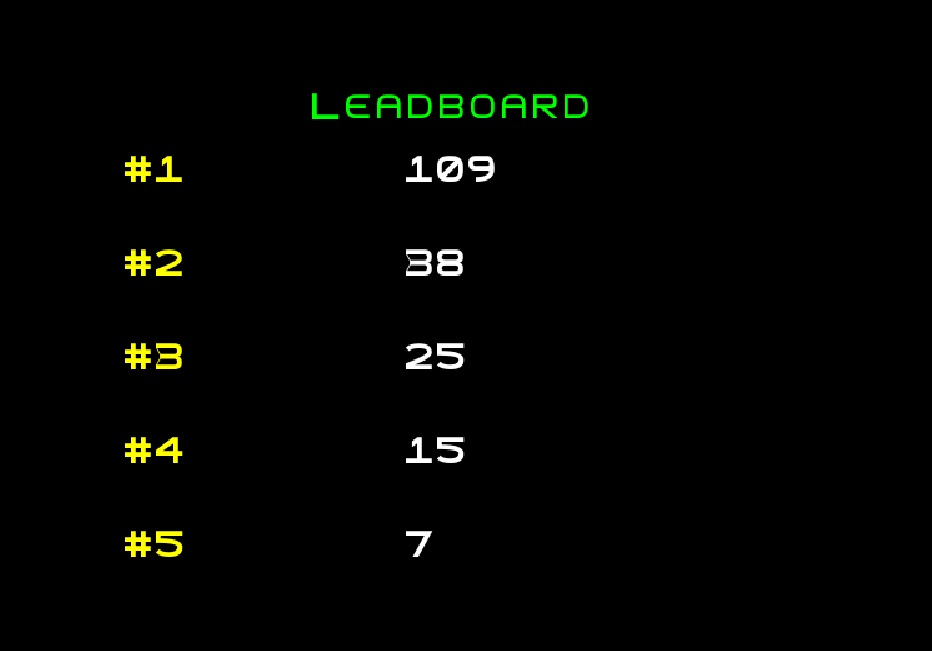

 # LDTS_T06_G06 - Zombie Zone

## Game Description

Zombie Zone is a fast-paced 2D arena shooter inspired by Space Invaders with a freer gameplay. Players navigate in the arena, avoiding walls while dodging and shooting waves of zombies. Each round intensifies the action, introducing stronger and more frequent enemies to keep the challenge alive.

Unlike Space Invaders, the player has complete freedom of movement, making strategic positioning crucial for survival. Every zombie eliminated with a projectile boosts the score, and a touch from a zombie costs the player a life.

With its action and difficulty, Zombie Zone tests your reflexes and resilience as you strive to achieve the highest score possible. How long can you survive? 

This project was developed by *Arthur Teixeira* (*up202300368*@fe.up.pt), *Divaldo Dias* (*up202309923*@fe.up.pt) and *Pedro Gouveia* (*up202200045*@fe.up.pt) for LEIC.LTDS 2024⁄25.

### IMPLEMENTED FEATURES
- **Connected Menus** - The user has the capability of browsing through the different menus. (Ex: Menu, Play, Game over, Try again).
- **Keyboard control** - The mouse and keyboard inputs are received through the respective events and interpreted according to the current game state.
- **Soldier control** - The soldier may move with the keyboard control and shoot his gun when arrows are pressed.
- **Walls** - Walls are obstacles created to limit the arena and randomized to obstruct the player's movement but without completely blocking the action, allowing the player to move freely, as long as he does not hit the so-called Walls.
- **Different zombies** - There is 3 types of zombies, the Normal Zombie('Z') has two lives and normal speed, the Speedy Zombie('S') has only one live, but it is way faster than the Normal Zombie and the Tank Zombie('T') has 4 lives but he is slower.
- **Life** - Both soldier and zombies have a life attribute, which decreases when they take damage.
- **Score** - When the soldier kills a zombies, the score is increased.
- **Shoot** - The soldier can shoot projectiles in every direction with a speed and a range predetermined to kill the enemies.
- **Delayed attack** - Both soldier and zombies have a delayed attack for balance purposes, the delay to the soldier to shoot is 1 second, while the zombie hit delay is 3 seconds so the player can reposition.
- **Round** - The round change when all zombies are killed, and each round increase makes the game harder.
- **Spawn** - The spawn of enemies varies with the round, using a function it increases the number and the chance for different zombies to appear.
- **Track** - A method that enemies use to trace the soldier on the shortest path, while considering the walls and another enemy.
- **LeaderBoard** - A menu where it is stored the past five best scores and if a higher score has been made, it changes the file.
- **GameOver** - When the player dies, the game over menu pop up, and you can select go back to menu or try again.
- **Hud** - Shows the score, round and life while playing in the arena.
- **Textured background** - For design purposes the arena is drawn with textured ground with gray shades.

### PLANNED FEATURES

All the planned features were successfully implemented.

### DESIGN

#### HANDLING THE DIFFERENT STATES OF THE GAME
**Problem in Context**

In the game, the system must support multiple states: Game State, Leaderboard State, Menu State, and Game Over State. Each state requires different behaviors and functionalities. Before implementing a design pattern, the state logic could have been managed with long conditional checks or switch statements inside a single run() method. This is not scalable as new states are added.

**The Pattern**

The State Pattern is applied to encapsulate state-specific behavior and allow transitioning between states dynamically. Each state implements the State<Interface> interface, which defines common operations like run() and getController(). The State Pattern makes it easier to add new states and removes scattered conditional logic.

**Implementation**

The State<Interface> defines the contract for the states. The states (GameState, MenuState, LeaderboardState, and GameOverState) implement this interface and provide unique behavior.

**Consequences**

- Cleaner, modular code where each state is isolated.
- Adding new states does not affect existing code.
- Increases the number of classes.

#### MANAGING GAME EVENTS LIKE SCORE UPDATES AND GAME ENDING
**Problem in Context**

The game requires real-time updates for events like changes to the score, rounds, or game ending. Initially, the game logic likely relied on tightly coupled classes to manage these updates, which made the system harder to maintain or extend.

**The Pattern**

The Observer Pattern is applied to decouple the game events from the objects that react to those events. Observers like ScoreObserver<Interface> and GameObserver<Interface> listen for changes in the game, such as when a score is updated or the game ends.

**Implementation**

Classes like Game and Hud generate events and GameObserver<Interface> listens for endGame() events and ScoreObserver<Interface> listens for score-related events through onEndGame().

**Consequences**

- Decoupling between the game logic and observers.
- New observers can be added without changing the existing code.
- Increases the number of classes.

#### CREATING DIFFERENT TYPES OF ZOMBIES
**Problem in Context**

The game features multiple types of enemies, such as ZombieNormal, ZombieSpeed, and ZombieHeavy. Initially, these zombies could have been created manually with specific constructors or hardcoded methods, leading to duplicated code and reduced flexibility.

**The Pattern**

The Factory Pattern is applied to encapsulate the creation logic of the enemy objects. This allows the game to create different types of zombies dynamically while centralizing the instantiation logic.

**Implementation**

The Enemy class serves as the base product with common attributes like life, speed, and elapsed_time.

**Consequences**

- Simplifies object creation logic.
- Easy to add new enemy types without changing existing code.
- The factory may need to handle many product types as the game expands.

#### CONTINUOUS EXECUTION OF GAME LOGIC AND RENDERING
**Problem in Context**

The game requires continuous execution of logic, including updates and rendering. Without a centralized game loop, the system may have handled updates and rendering in an unreliable manner. 

**The Pattern**

The Game Loop Pattern is applied to centralize the execution of game updates and rendering. This ensures that all game components are updated in a synchronized manner within a single loop.

**Implementation**

Views like GameView, MenuView, and HudView implement the View<Interface> interface and render components through render(), and each state manages the controller logic getController().

**Consequences**

- Centralized game execution simplifies synchronization of updates and rendering.
- Easy to manage frame rates and updates.

#### KNOWN CODE SMELLS

The major code smell that was analyzed was in the class Game, it has too many attributes and methods that can complicate the design if we want to increase the number of features in the game.
In second instance, the group has struggled a bit in the Initializer class, specially at the massive class constructor.

### TESTING

#### Overall Test Coverage
- 
- 
- #### Mutation Testing
- The mutation testing topic unfortunately was the biggest issue for the group. After several tryouts to implement, following the teacher's advice, searching other alternatives, consultating the pitest website, we have ended up not being able to have the mutation testing done, despite all the effort on building a sturdy and complete test code. Afterknowing that we would not make it, the group has decided to reverse the changes in the code in order to keep the code cleaner and more organized.

### SELF-EVALUATION

- Arthur Teixeira: 33.33%
- Divaldo Dias: 33.33%%
- Pedro Gouveia: 33.33%
- All the components of the group have worked with a similar amount of effort. We have organized ourselves in order to attempt all the tasks and there is nothing to complain about the inidividual perfomance of any member. The result of the evaluation should be equal for everyone.